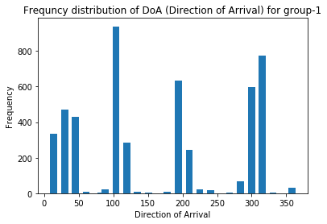
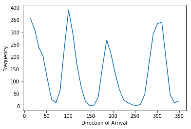
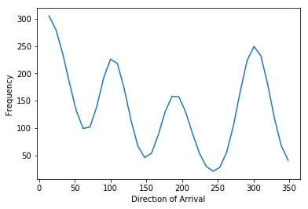
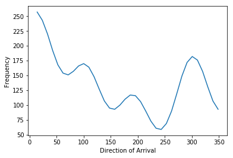
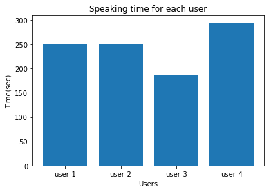
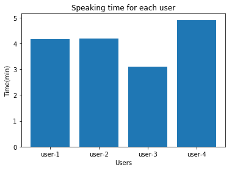
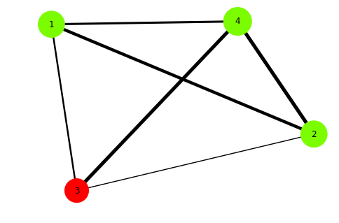

====================================
DoaProcessor Tutorials
====================================

DoA data file contains the direction of sound detected by the microphone array. This class provides functions to process DoA (Direction of Arrival) datafile.

Loading data file
-----------------
The first step towards processing doa data file is to load that file. DoaProcessor support doa datafile in the following format::

   group-label,timestamp,direction

A snapshot of the data file is shown in the below image

>>> from pydoa import DoaProcessor
>>> # Specify name of data file and number of speakers
>>> doa = DoaProcessor('file.csv',4)

::

  PyDoA Library
  [ 2020-01-15 17:14:18.542458 ] Initialized
  [ 2020-01-15 17:14:18.542544 ] File loaded successfully

Getting group labels
--------------------
To get all group labels available in data file, use `getGroups()` function. From this section onwards, examples will use the sample.csv file provided in the samples directory.
Example::

>>> # load the data file
>>> from DoaProcessor import DoaProcessor
>>> d = DoaProcessor('./samples/sample.csv',4)
>>> d.getGroups()

::

`array(['group-1'], dtype=object)`

Our data file has only a single group label (group-1) which means the data file contains data from a single group.

Plotting degree distribution
----------------------------
`DoaProcessor` class has a function `plotDegreeDistribution` to plot distribution of directions recorded in the data file.

Example::

>>> from pydoa import DoaProcessor
>>> # Specify name of data file and number of speakers
>>> doa = DoaProcessor('file.csv',4)
>>> doa.plotDegreeDistribution(group='group-1')

Plotting smooth degree distribution
-----------------------------------
DoaProcessor allows the facility to smoothify the degree distribution using the Gaussian kernel and also to identify the peaks for exploration purposes.
You need to load the file as the previous section. The example, however, skipped that part assuming you have already loaded the file.
Example-1::

>>> # load the file same as previous
>>> doa.getPeakDegree(group='group-1',sigma=1)

`array([100.        , 186.        , 300.66666667])`

You can control the smoothness of the plot using `sigma` parameter.
Example-2::

>>> # load the file same as previous
>>> doa.getPeakDegree(group='group-1',sigma=2.0)

`array([100.        , 186.        , 300.66666667])`

Example-3::

>>> # load the file same as previous
>>> doa.getPeakDegree(group='group-1',sigma=3.0)

`array([100.        , 186.        , 300.66666667])`

Getting n degrees corresponding to speakers
--------------------------------------------
You can automatically extract the directions corresponding to the speaker. In order to use this function correctly, you need to ensure the following assumptions

1. Speakers are sitting with an equal gap with their neighbors. For instance, in the case of a four-speaker, each speaker sitting at a 90-degree angle to each other.
2. Speakers did not move much during speaking from the position.

If the above assumptions are not met then we suggest you set the corresponding directions manually (given in next section)

Example::

>>> doa.getHighestNdegrees(group='group-1',sep=60)

`[30, 104, 194, 315]`

Setting degrees corresponding to speakers
------------------------------------------
In order to compute speaking time, you need to specify the corresponding angle at which speakers were sitting around microphone array.
You can either use the function discussed in the above section to get those directions or you can manually check from the degree distribution.
Example::

>>> # specify manually
>>> doa.setDegreeForSpeaker(group='group-1',[30,104,194,315])

>>> # option-2
>>> deg = doa.getHighestNdegrees(group='group-1')
>>> doa.setDegreeForSpeaker(group='group-1',deg)

Plotting speaking time for each speaker
----------------------------------------
Function `getSpeakingTime()` computes speaking time for each speaker and plot the speaking distribution.

Example::

>>> # load the file
>>> deg = doa.getHighestNdegrees()
>>> doa.setDegreeForSpeaker()
>>> doa.getSpeakingTime(plot=True,time='sec',granularity=200,group='group-1)

Example-2::

>>> d.getSpeakingTime(plot=True,time='min')

{1: 4.156666666666667, 2: 4.193333333333333, 3: 3.0966666666666667, 4: 4.91}

:Parameters:

    time (int) - specify unit ('sec','min','hour')

    graularity(int) - specify the time duration for detected direction in milliseconds. Defaults value is 200 ms.

    group (str) - Specify group label

Generate Edge file
-------------------
DoaProcessor alow provides the facility to generate a graph edge file that can be used by third party graph processing tools or API. It generates edge file with entries like (i,j) where i and j represent the speaker-i and speaker-j and edge represents that speaker-j spoke after speaker-i.

Example::

>> load the file
>> # generating edge file for 'group-1'
>> doa.generateEdgeFile(group='group-1',threshold=3,edge_filename='grp1_edge.txt')

The above code will generate a file with edges.
:Parameters:

   group(str) -- Group label

   threshold(int) -- this number specifies how many consecutive entries from a single speaker will be considered as a speaking activity. This can be used to remove noisy data.

   edge_filename(str) -- Specify the name of edge file

Draw Interaction network
-------------------------
DoaProcessor has functionality to draw the network showing the interaction among the speakers.

>>> doa.drawNetwork(group='group-1')

Size of the node represent the speaking time.

Green node: Corresponding speaker's speaking time is greater than average speaking time.

Red node: Corresponding speaker's speaking time is less than average speaking time.
